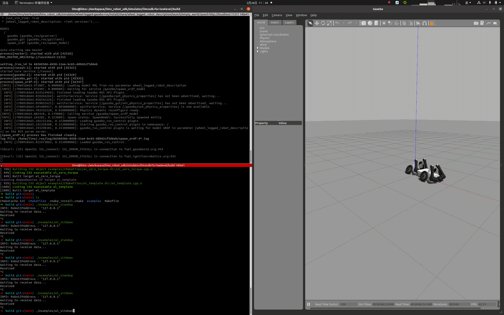

# wheel-legged-gazebo-ros 仿真使用说明

## 1. 环境搭建

- 安装 Ubuntu 20.04 桌面操作系统

- 按此链接安装 ROS：http://wiki.ros.org/noetic/Installation/Ubuntu ，选择“ros-noetic-desktop-full”进行安装

- 按以下 shell 命令安装其它依赖：

  ```
  sudo apt-get update
  sudo apt install ros-noetic-hector-sensors-description \
                   ros-noetic-joint-trajectory-controller \
                   ros-noetic-urdf* \
                   ros-noetic-robot-* \
                   ros-noetic-controller-* \
                   ros-noetic-gazebo-* \
                   ros-noetic-ros-control \
                   ros-noetic-ecl-threads \
                   ros-noetic-hector-gazebo-plugins \
                   ros-noetic-velodyne-simulator \
                   ros-noetic-velodyne-description \
                   ros-noetic-teleop-twist-keyboard \
                   cmake build-essential libpcl-dev libeigen3-dev libopencv-dev libmatio-dev \
                   python3-pip libboost-all-dev libtbb-dev liburdfdom-dev liborocos-kdl-dev
  ```

## 2、编译

```
mkdir -p ~/limx_ws/src

cd ~/limx_ws/src
git clone https://github.com/limxdynamics/robot-description.git
git clone https://github.com/limxdynamics/wheellegged-gazebo-ros.git

cd ~/limx_ws
catkin_make install
```

## 3、运行

- 运行`wheellegged-gazebo-ros`仿真的同时，还需要运行一个基于 [wheellegged-sdk-lowlevel](https://github.com/limxdynamics/wheellegged-sdk-lowlevel) 实现的运动控制算法程序。仿真运行流程如下图所示。


- 开启一个终端：运行仿真

  ```
  source /opt/ros/noetic/setup.bash
  source install/setup.bash
  roslaunch wheellegged_gazebo empty_world.launch
  ```

- 开启另一个终端：运行一个基于 [wheellegged-sdk-lowlevel](https://github.com/limxdynamics/wheellegged-sdk-lowlevel) 实现的运动控制算法程序

  ```
  limx@limx:~/wheellegged-sdk-lowlevel/build$ ./examples/wl_standup
  ```

- 运行效果如下：
  
